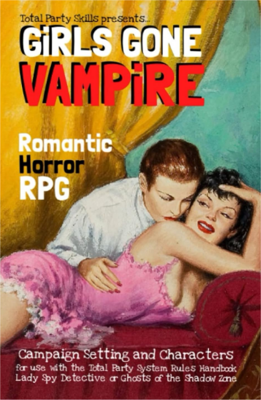
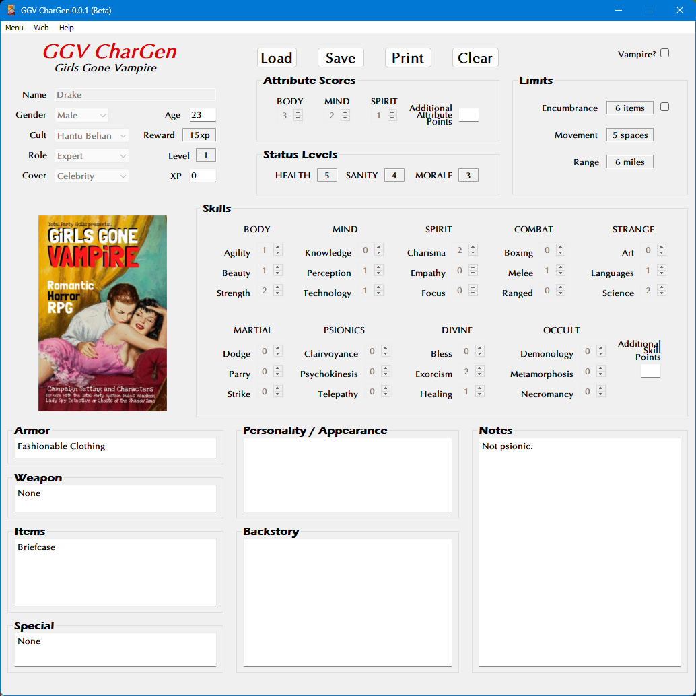

**Girls Gone Vampire RPG Character Generator**
==============================================

**Girls Gone Vampire RPG Character Generator** is a Windows program for creating characters using the Total Party Skills system.

Notes
-----

**Girls Gone Vampire RPG Character Generator** is being developed using Python 3.11.6 and PyQt5.

Requirements
------------

* **Windows 11**

  It will also run on Windows 10.

* **Python 3.11.6**

  This code was written using the C implementation of Python
  version 3.11.6. Also known as CPython.

* **PyQt5 5.15.9**

  PyQt5 is the framework used for displaying the Window GUI and buttons, etc.

* **fpdf2 2.7.5**

  Fpdf2 is needed for printing the character sheets.

Things To-Do
------------

| Continue unifying the skills across all TPS genres.
| Instruction manual.
| Cheat codes.

Known History
-------------

* v0.1.0b

  Boeotian Club initiates can become psychic vampires.
  Hantu Belian Society female initiates can become were-cats.
  Hantu Belian Society male initiates can decide to leave (for a Personality Cult).
  Goddess Cult initiates can become junior members of the Druidess Council.

  Character sheets report if characters are vampires or not.

* v0.0.1b

  Initial release.

Girls Gone Vampire RPG was written by R. Joshua Holland.
Copyright 2023, Total Party Skills.
https://www.drivethrurpg.com/product/443514/GiRLS-GONE-VAMPiRE

Contact
-------
Questions? Please contact shawndriscoll@hotmail.com
